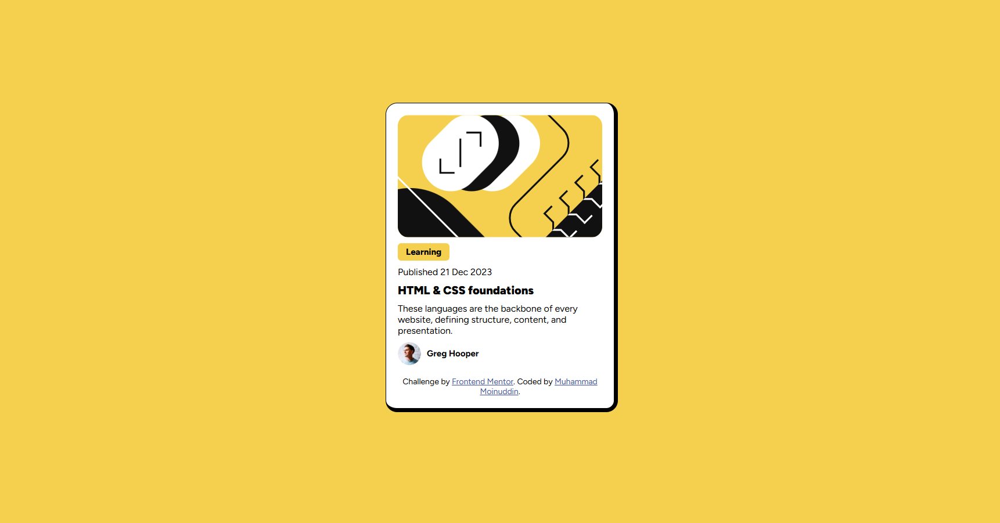

# Frontend Mentor - Blog Preview Card Solution

This is my solution to the Blog Preview Card Challenge on Frontend Mentor. This challenge helped me strengthen my understanding of layout, spacing, and CSS positioning using a mobile-first workflow.

---

## Table of Contents

- [Overview](#overview)
  - [The Challenge](#the-challenge)
  - [Screenshot](#screenshot)
  - [Links](#links)
- [My Process](#my-process)
  - [Built With](#built-with)
  - [What I Learned](#what-i-learned)
  - [Continued Development](#continued-development)
- [Author](#author)
- [Acknowledgments](#acknowledgments)

---

## Overview

### The Challenge

Users should be able to:

- View the optimal layout depending on their device screen size
- See hover and focus states for interactive elements

---

### Screenshot



---

### Links

- Solution URL: https://www.frontendmentor.io/profile/moinuddin2003
- Live Site URL: https://moinuddin2003.github.io/BlogPreviewCard/

---

## My Process

### Built With

- Semantic HTML5 markup
- CSS custom properties
- Flexbox
- Mobile-first workflow
- Google Fonts (Figtree)

---

## What I Learned

While building this project, I strengthened my understanding of several important CSS concepts.

### 1. Flexbox Alignment

I learned how `display: flex` works in column direction and how child elements stretch by default.

```css
.card-intro {
  display: flex;
  flex-direction: column;
}
```

To prevent stretching:

```css
.learning {
  align-self: flex-start;
}
```

---

### 2. Difference Between rem, em, and px

- rem is relative to the root (html) font-size  
- em is relative to the parent element  
- px is fixed  

Using:

```css
* {
  font-size: 16px;
}
```

can override child font sizes unexpectedly.  
It is better to define base font size on `body` instead.

---

### 3. Inline vs Block vs Inline-Block

For the "Learning" badge, I learned why:

```css
display: inline-block;
```

is important to prevent full-width stretching.

---

### 4. Centering with Flexbox

```css
body {
  display: flex;
  justify-content: center;
  align-items: center;
  min-height: 100vh;
}
```

---

### 5. Image Responsiveness

```css
img {
  width: 100%;
  display: block;
}
```

This ensures the image scales properly inside its container.

---

## Continued Development

In future projects, I want to:

- Improve responsive design techniques
- Write cleaner and more scalable CSS
- Use CSS Grid in more complex layouts
- Improve accessibility and focus states

---

## Author

Name: Muhammad Moinuddin  

Frontend Mentor: https://www.frontendmentor.io/profile/moinuddin2003

GitHub: https://github.com/moinuddin2003  

---

## Acknowledgments

Thanks to Frontend Mentor for providing real-world challenges that help developers improve their frontend skills through practice.